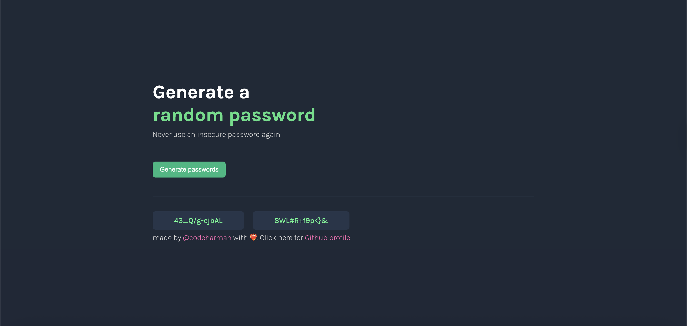

# 🔐 Password Generator  
[Visit the website here](https://password-generator-codeharman.vercel.app/)  

A simple and secure password generator built with HTML, CSS, and JavaScript. Generate strong random passwords with just one click.  

---

## Features
- Generate two random passwords at a time.  
- Choose the desired password length.  
- Copy passwords to clipboard with a single click.  
- Uses letters, numbers, and symbols for strong security.  
- Responsive and easy-to-use interface.  

---

## 🛠️ Tech Stack
- HTML5 – Structure  
- CSS3 – Styling  
- Vanilla JavaScript – Password generation logic  

---

## 📬 Let's Connect
[](https://codeharman.vercel.app/)
[](https://www.linkedin.com/in/codeharman/)
[-000000?style=flat&logo=x&logoColor=white)](https://x.com/codeharmann)
[](mailto:iamsingh.hj@email.com)

---

## Demo
  

---

## Installation
Clone the repository:  
```bash
git clone https://github.com/codeharman/Password-Generator

cd password-generator
```
## Usage

- Enter the desired password length.
- Click Generate Passwords to see two random passwords.
- Click on a password to copy it to your clipboard.
- Repeat to generate new secure passwords.

```
password-generator/
├─ index.html        # Main HTML file
├─ 1.png             # demo image
├─ styles.css        # Styling for the generator
├─ app.js            # JavaScript for password generation logic
└─ README.md
